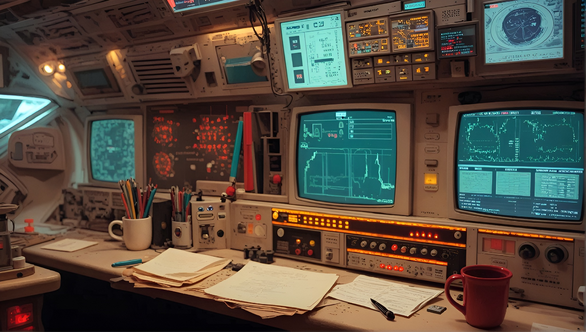

# FastScreen  0.1.0 [ALPHA]  High-performance screen capture for Java

[](https://github.com/andrestubbe/FastScreen/releases/tag/0.1.0)
[](https://opensource.org/licenses/MIT)
[](https://www.java.com)
[]()
[](https://jitpack.io/#andrestubbe)

**âš¡ Ultra-fast Java screen capture library  500-2000 FPS zero-copy capture**

FastScreen is a **high-performance Java screen capture library** and part of the **FastJava ecosystem**. It uses **DXGI
Desktop Duplication API** for **zero-copy, hardware-accelerated screen capture** at 500-2000 FPS. Built for **computer
vision**, **gaming bots**, **screen recording**, and **real-time monitoring** applications.

If you need **high-FPS screen capture** without the 50-100ms latency of `java.awt.Robot`, FastScreen delivers
native-level performance with Java simplicity. Part of the FastJava ecosystem  *Making the JVM faster.*

[](https://www.youtube.com/watch?v=BZsqQl7WqWk)

---

## Table of Contents

- [Features](#features)
- [Installation](#installation)
- [License](#license)

---

## Quick Start

```java
import fastjson.FastJSON;
import fastjson.FastJsonValue;

public class Demo {
    public static void main(String[] args) {
        // TODO
    }
}
```

---

## Key Features

- **? 5002000 FPS capture**  Zero-copy DXGI Desktop Duplication
- **🚀 1017 faster** than `java.awt.Robot` (816ms vs 50100ms)
- **🚀 Hardware acceleration**  GPU ? CPU without memory copy
- **🚀 Zero GC pressure**  Native buffers, reusable arrays
- **🚀 Multiple outputs**  `BufferedImage`, raw pixels, or stream callback
- **🚀 Powered by FastCore**  Unified JNI loader for all FastJava modules
- **🚀 MIT licensed**  free for commercial use

---

## Installation

### Option 1: Maven (Recommended)

Add the JitPack repository and the dependencies to your `pom.xml`:

```xml

<repositories>
    <repository>
        <id>jitpack.io</id>
        <url>https://jitpack.io</url>
    </repository>
</repositories>

<dependencies>
<dependency>
    <groupId>com.github.andrestubbe</groupId>
    <artifactId>fastscreen</artifactId>
    <version>0.1.0</version>
</dependency>
<dependency>
    <groupId>com.github.andrestubbe</groupId>
    <artifactId>fastcore</artifactId>
    <version>0.1.0</version>
</dependency>
</dependencies>
```

### Option 2: Gradle (via JitPack)

```groovy
repositories {
    maven { url 'https://jitpack.io' }
}

dependencies {
    implementation 'com.github.andrestubbe:fastscreen:0.1.0'
    implementation 'com.github.andrestubbe:fastcore:0.1.0'
}
```

### Option 3: Direct Download (No Build Tool)

Download the latest JARs directly to add them to your classpath:

1. 🚀 **[fastscreen-0.1.0.jar](https://github.com/andrestubbe/FastScreen/releases/download/0.1.0/fastscreen-0.1.0.jar)
   ** (The Core Library)
2. 🚀 **[fastcore-0.1.0.jar](https://github.com/andrestubbe/FastCore/releases/download/0.1.0/fastcore-0.1.0.jar)** (
   The Mandatory Native Loader)

## Performance Benchmarks

**Measure yourself**  run the included benchmark:

```bash
cd examples/03-benchmark
mvn compile exec:java
```

**Expected improvements** (your hardware may vary):

- Single capture: **10-50 faster** than `java.awt.Robot`
- Streaming: **60-240fps** depending on GPU and resolution
- Zero GC pressure with native buffers

See [examples/03-benchmark](examples/03-benchmark) for detailed measurement.

---

## Examples

All examples are in the `examples/` folder:

```bash
# Basic screenshot demo
 [ALPHA] - 0.1.0
cd examples/00-basic-capture
mvn compile exec:java

# High-FPS streaming demo
 [ALPHA] - 0.1.0
cd examples/01-streaming
cd examples/02-vision-pipeline
```

---

## API Reference

### Screen Capture

- `captureScreen(Rectangle rect)`  BufferedImage screenshot
- `captureRaw(int x, int y, int w, int h)`  Raw RGBA pixel array
- `getPixelColor(int x, int y)`  Single pixel (fast)

### Streaming (High-FPS)

- `startStream(int x, int y, int w, int h)`  Begin capture stream
- `hasNewFrame()`  Check for new frame available
- `getNextFrame()`  Get next frame (non-blocking)
- `stopStream()`  Stop and cleanup
- `getStreamFPS()`  Current capture FPS

### Monitor Selection

- `getMonitorCount()`  Number of displays
- `captureMonitor(int index)`  Capture specific monitor

---

## Architecture

```
Java API (FastScreen.java)
    ? JNI (via FastCore)
Native Layer (C++/Win32)
    +-- DXGI Desktop Duplication API
        +-- Direct GPU framebuffer access
    ?
Windows OS (Hardware)
```

---

## Documentation

* **[PHILOSOPHY.md](docs/PHILOSOPHY.md)**: The engineering rationale for zero-allocation performance.
* **[ROADMAP.md](docs/ROADMAP.md)**: Future milestones and planned features.
* **[REFERENCE.md](docs/REFERENCE.md)**: Full API descriptions, border configurations, and codepoint index.
* **[COMPILE.md](docs/COMPILE.md)**: Full compilation guide (MSVC C++17 build chain + JNI Setup).

---

## Platform Support

| Platform      | Status            |
|---------------|-------------------|
| Windows 10/11 | ? Fully Supported |
| Linux         | 🚀 Planned        |
| macOS         | 🚀 Planned        |

---

## License

MIT License  See [LICENSE](LICENSE) file for details.

---

## Related Projects

- [FastCore](https://github.com/andrestubbe/FastCore)  Native Library Loader for Java
- [FastScreen](https://github.com/andrestubbe/FastScreen)  High-performance RawInput engine
- [FastTheme](https://github.com/andrestubbe/FastTheme)  Advanced UI styling engine

---
**Part of the FastJava Ecosystem**  *Making the JVM faster. Small package. Maximum speed. Zero bloat. 🚀🚀*


