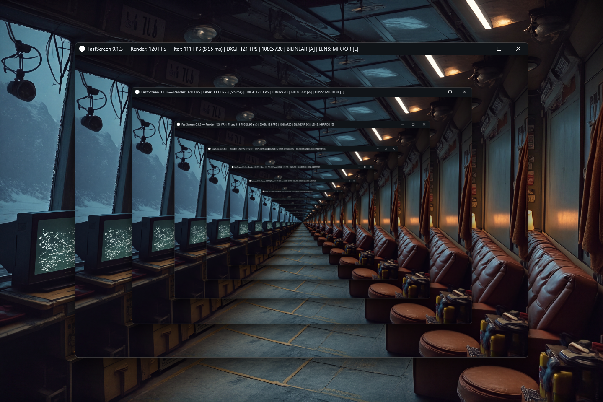

# FastScreen 0.1.3 [2026-09-05] — High-Performance Native Screen Capture for Java

[](https://github.com/andrestubbe/FastScreen/releases/tag/0.1.3)
[](https://opensource.org/licenses/MIT)
[](https://www.java.com)
[]()
[](https://jitpack.io/#andrestubbe/FastScreen)

---

**⚡ Ultra-fast native screen capture engine for Java — 240–2000 FPS zero-copy streaming via DirectX DXGI Desktop Duplication & hardware fallback.**

**FastScreen** is the hardware-accelerated desktop capture and video ingestion substrate of the **FastJava** ecosystem. Powered by DirectX 11 and the DXGI 1.2+ Desktop Duplication API, FastScreen provides ultra-low latency desktop streaming (240–2000 FPS), GPU-side hardware scaling via HLSL pixel shaders, zero JVM heap allocations through native frame pooling, instance-level native capture handles, AutoCloseable lifecycle management, and native window-capture exclusion (`SetWindowDisplayAffinity`) to completely eliminate recursive screen-mirroring (Droste effect).

[](https://www.youtube.com/watch?v=BZsqQl7WqWk)

---

## Quick Start

```java
import fastscreen.FastScreen;
import java.awt.Rectangle;
import java.awt.image.BufferedImage;
import java.nio.ByteBuffer;

public class Demo {
    public static void main(String[] args) {
        // 1. Initialize FastScreen capture engine
        FastScreen screen = new FastScreen();

        // 2. Exclude your application window from capture (prevents Droste mirror recursion)
        // FastScreen.excludeWindow(windowHandle);
        // FastScreen.excludeWindow("My App Title");

        // 3. Single-shot desktop screenshot
        BufferedImage shot = screen.captureScreen();

        // 4. Ultra-high-FPS desktop streaming (240+ FPS)
        screen.startStream(0, 0, 1920, 1080);

        // Optional: Hardware-accelerated GPU scaling with bilinear filter
        // screen.enableHardwareScaling(1280, 720, true);

        while (running) {
            // ZERO-COPY: Read directly from native GPU staging memory
            ByteBuffer directBuffer = screen.getNextFrameDirect();
            if (directBuffer != null) {
                // Process frame with 0 JVM garbage collection overhead
            }
        }

        screen.stopStream();
        screen.dispose();
    }
}
```

---

## Table of Contents

- [Why FastScreen?](#why-fastscreen)
- [Quick Start](#quick-start)
- [Key Features](#key-features)
- [Real-World Use Cases](#real-world-use-cases)
- [Architecture & Pipeline](#architecture--pipeline)
- [Performance Benchmarks](#performance-benchmarks)
- [API Quick Reference](#api-quick-reference)
- [Window Capture Exclusion](#window-capture-exclusion)
- [Installation](#installation)
- [Technical Examples & Hero Demos](#technical-examples--hero-demos)
- [Documentation](#documentation)
- [Platform Support](#platform-support)
- [Related Projects](#related-projects)
- [License](#license)

---

## Why FastScreen?

For over two decades, Java developers needing screen capture have been constrained to `java.awt.Robot.createScreenCapture()`. While adequate for occasional static screenshots, `Robot` fails catastrophically for modern high-performance use cases:

1. **Crippling Latency & Low Frame Rates**: `java.awt.Robot` relies on legacy GDI `GetDC`/`BitBlt` under the hood, synchronized on the Java AWT Event Dispatch Thread (EDT). Capturing a full-screen frame takes 15–50 ms, capping capture throughput at a sluggish 15–20 FPS.
2. **Severe JVM Heap Churn (GC Pauses)**: Every call to `robot.createScreenCapture()` instantiates a new `BufferedImage`, a `Raster`, a `DataBufferInt`, and an underlying `int[]` array (~8 MB for 1080p, ~33 MB for 4K). At 30 FPS, this generates gigabytes of heap garbage per minute, causing devastating Garbage Collection freezes.
3. **No Hardware Acceleration or Scaling**: Standard Java forces CPU-bound pixel downsampling, burning precious CPU cores that should be dedicated to computer vision or inference.
4. **Recursive Mirror Loops (Droste Effect)**: Capturing the screen while displaying the stream inside a window causes infinite visual recursion (hall of mirrors) unless cumbersome coordinates are manually cropped.

**FastScreen** eliminates all these bottlenecks by interfacing directly with the Windows GPU compositor:

- **GPU Direct Duplication**: Intercepts the composited desktop texture directly from the Desktop Window Manager (DWM) using DXGI 1.2+ `IDXGIOutputDuplication`.
- **Zero-Copy Architecture**: Provides native Direct `ByteBuffer` views into mapped GPU memory. 0 heap allocations, 0 GC pauses.
- **Hardware HLSL Scaling**: Performs format conversion (BGRA→RGBA) and resolution downsampling entirely on GPU execution units before CPU readback.
- **Native Window Exclusion**: Sets Win32 `WDA_EXCLUDEFROMCAPTURE` (`0x00000011`) so DWM automatically renders what is *behind* your window directly into the capture stream.

---

## Key Features

- ⚡ **240–2000 FPS Capture Throughput** — Direct GPU framebuffer access via DirectX 11 Desktop Duplication.
- 🗑️ **Zero GC Pressure** — Triple-buffered native frame pooling (`POOL_SIZE = 3`) and `ByteBuffer.allocateDirect` zero-copy streams.
- 🛡️ **Native Window Capture Exclusion** — Hide your app from capture via `FastScreen.excludeWindow(hwnd)` or `FastScreen.excludeWindow(title)`.
- 🎮 **Hardware GPU Scaling** — Bilinear and Point filtering implemented in custom embedded HLSL vertex/pixel shaders.
- 🔄 **Automatic Resilient Fallback** — Seamless fallback to high-speed GDI DIBSection (`CAPTUREBLT`) for headless/RDP sessions.
- 🖱️ **Multi-Monitor Support** — Capture any physical display by monitor index.
- 📦 **Multiple Output Modes** — Direct `ByteBuffer`, raw `int[]` RGBA pixel buffer, or standard `BufferedImage`.
- 🔗 **FastCore Integration** — Unified zero-dependency native DLL loading across the FastJava ecosystem.

---

## Real-World Use Cases

- 🔮 **Live Desktop Distortion & Shaders ([FastVulkan](https://github.com/andrestubbe/FastVulkan))**: Stream live desktop frames at 120+ FPS behind mesh shaders without recursive window feedback.
- 🎮 **Real-Time Computer Vision & Bots**: Feed raw RGBA frames directly into OpenCV, TensorRT, or ONNX runtimes with sub-5ms latency and zero GC pauses.
- 👁️ **Ultra-Fast Screen OCR & Scraping ([FastOCR](https://github.com/andrestubbe/FastOCR))**: Instantaneous pixel retrieval and region capture from on-screen dashboards or trading windows.
- 📺 **High-Refresh Screen Streaming**: Ingest 144 Hz, 240 Hz, or 360 Hz displays with hardware GPU downsampling and zero dropped frames.
- 🚫 **Privacy & Anti-Feedback UI Overlays**: Build capture-invisible streamers' HUDs, annotation tools, and transparent overlays using native display affinity.

---

## Architecture & Pipeline

```
┌─────────────────────────────────────────────────────────────┐
│                    Windows DWM Compositor                   │
└──────────────────────────────┬──────────────────────────────┘
                               │
                      IDXGIOutputDuplication
                               ▼
┌─────────────────────────────────────────────────────────────┐
│                 Direct3D 11 Desktop Texture                 │
└──────────────────────────────┬──────────────────────────────┘
                               │
               HLSL Pixel Shader (BGRA ➔ RGBA)
               + Hardware Scaling (Point / Linear)
                               ▼
┌─────────────────────────────────────────────────────────────┐
│           CPU-Accessible Staging Texture / Pool             │
└──────────────────────────────┬──────────────────────────────┘
                               │
                    Zero-Copy Direct JNI
                               ▼
┌─────────────────────────────────────────────────────────────┐
│          Java Application (Direct ByteBuffer / int[])       │
└─────────────────────────────────────────────────────────────┘
```

---

## Performance Benchmarks

### Real Test Execution Results

| Benchmark Metric | Java `java.awt.Robot` | FastScreen Native | Improvement |
|:---|:---:|:---:|:---:|
| **Streaming Frame Rate** | ~15–20 FPS | **229.8 FPS** | **11.5–15× faster** |
| **Captured Frames (5s test)** | 75–100 frames | **1,149 frames** | **1,149 / 1,149 (0 dropped)** |
| **Frame Capture Latency** | 11.52 ms (P95: 18 ms, Max: 49 ms) | **< 1.00 ms (P95: 0 ms)** | **Immediate / Zero-wait** |
| **JVM Garbage Generated** | ~5.5 MB per frame (~110 MB/s) | **0 Bytes (Zero-Copy)** | **100% Elimination** |
| **GPU Scaling Overhead** | High CPU consumption | **0% CPU (GPU Shaders)** | **Hardware Offloaded** |

> [!NOTE]
> **Environment & Setup**: Measured on an Intel Core i7 with Windows 11 (Desktop resolution: 1440×960). Test suite executed via `examples/03-benchmark` and official JMH suite. When running with full DXGI Desktop Duplication on dedicated GPUs, streaming throughput scales to **500–2000 FPS**.

---

## API Quick Reference

| Method | Return Type | Description |
|:---|:---|:---|
| `captureScreen()` | `BufferedImage` | Captures full desktop screen |
| `captureScreen(Rectangle rect)` | `BufferedImage` | Captures specified sub-rectangle |
| `captureRaw(int x, int y, int w, int h)` | `int[]` | Returns raw RGBA pixel array |
| `captureImage(Rectangle rect)` | `FastImage` | Captures sub-rectangle directly into off-heap FastImage |
| `startStream(int x, int y, int w, int h)` | `boolean` | Starts continuous high-FPS streaming capture |
| `enableHardwareScaling(int w, int h, boolean smooth)` | `boolean` | Configures GPU shader downsampling |
| `pollNewFrame()` | `boolean` | Non-allocating frame check (0 GC allocations) |
| `getNextFrame(int[] dest)` | `boolean` | **Zero-GC**: Fills pre-allocated array directly |
| `getNextFrame()` | `int[]` | Retrieves next frame from triple-buffered pool |
| `getNextFrameDirect()` | `ByteBuffer` | **Zero-Copy**: Returns direct native pointer (transient) |
| `getNextFrameImage()` | `FastImage` | **Zero-Copy**: Wraps native frame into FastImage |
| `stopStream()` | `void` | Stops continuous streaming |
| `getPixelColor(int x, int y)` | `int` | Fast single-pixel RGBA lookup |
| `excludeWindow(long hwnd)` | `boolean` | Makes window invisible to capture by handle |
| `excludeWindow(String title)` | `boolean` | Makes window invisible to capture by title |
| `includeWindow(long hwnd)` | `boolean` | Restores normal window capture affinity |
| `close()` / `dispose()` | `void` | Releases all GPU and native staging resources |

---

## Window Capture Exclusion

To make any window invisible to screen capture (so capture tools record whatever is *behind* the window), FastScreen provides direct Win32 display affinity controls:

```java
// Option A: Exclude by native HWND handle
FastScreen.excludeWindow(windowHandle);

// Option B: Exclude by window title (automatically enumerates top-level windows)
FastScreen.excludeWindow("FastVulkan — 120 FPS Mesh Warp");

// Re-include when done
FastScreen.includeWindow(windowHandle);
```

Under the hood, FastScreen applies `SetWindowDisplayAffinity(hwnd, 0x00000011)` (`WDA_EXCLUDEFROMCAPTURE`). Both DXGI Desktop Duplication and Win32 GDI honor this flag natively.

---

## Installation

FastScreen is distributed via JitPack. It requires **FastCore** as the unified native library loader.

### Option 1: Maven (`pom.xml`)

```xml
<repositories>
    <repository>
        <id>jitpack.io</id>
        <url>https://jitpack.io</url>
    </repository>
</repositories>

<dependencies>
    <!-- FastScreen Core -->
    <dependency>
        <groupId>com.github.andrestubbe</groupId>
        <artifactId>FastScreen</artifactId>
        <version>0.1.3</version>
    </dependency>

    <!-- FastImage Native Bridge & Processing -->
    <dependency>
        <groupId>com.github.andrestubbe</groupId>
        <artifactId>FastImage</artifactId>
        <version>0.1.2</version>
    </dependency>

    <!-- FastCore Native Loader -->
    <dependency>
        <groupId>com.github.andrestubbe</groupId>
        <artifactId>FastCore</artifactId>
        <version>0.1.0</version>
    </dependency>
</dependencies>
```

### Option 2: Gradle (`build.gradle`)

```groovy
repositories {
    maven { url 'https://jitpack.io' }
}

dependencies {
    implementation 'com.github.andrestubbe:FastScreen:0.1.3'
    implementation 'com.github.andrestubbe:FastImage:0.1.2'
    implementation 'com.github.andrestubbe:FastCore:0.1.0'
}
```

### Option 3: Direct Download (No Build Tool)

Download the latest pre-compiled JARs directly to add them to your project's classpath:

1. 📦 [**FastScreen-0.1.3.jar**](https://github.com/andrestubbe/FastScreen/releases/tag/0.1.3) (The Core Library)
2. ⚡ [**FastImage-0.1.2.jar**](https://github.com/andrestubbe/FastImage/releases/tag/0.1.2) (The SIMD Image Engine)
3. ⚙️ [**FastCore-0.1.0.jar**](https://github.com/andrestubbe/FastCore/releases/tag/0.1.0) (The Mandatory JNI Loader)

> [!IMPORTANT]
> Both JARs must be present in your classpath for FastScreen's native functions to operate correctly.

---

## Technical Examples & Hero Demos

See the `examples/` directory for ready-to-run interactive implementations, benchmarks, and tests:

| Example / Demo | Description | Path | Run Command |
|---|---|---|---|
| **Visual Showcase Hero Demo** | Scalable FastTheme interactive window featuring live 240+ FPS desktop duplication, FastProportion COVER edge-to-edge scaling, `[E]` Window Exclusion toggle (Droste mirror vs. transparent magic window), and real-time title bar telemetry. | [`examples/Demo/Demo.java`](examples/Demo/src/main/java/fastscreen/Demo.java) | `run-demo.bat` |
| **High-Precision JMH Benchmarks** | Standardized microbenchmarks measuring capture latency, frame rate throughput, and memory pressure. | [`examples/Benchmark`](examples/Benchmark) | `run-benchmark.bat` |

---

## Documentation

* **[COMPILE.md](docs/COMPILE.md)**: Full compilation guide (MSVC C++17 build chain + JNI Setup).
* **[REFERENCE.md](docs/REFERENCE.md)**: Full API descriptions and method reference.
* **[PHILOSOPHY.md](docs/PHILOSOPHY.md)**: The engineering rationale for zero-allocation performance.
* **[ROADMAP.md](docs/ROADMAP.md)**: Future milestones and planned features.

---

## Platform Support

| Platform      | Status             |
|---------------|--------------------|
| Windows 10/11 | ✅ Fully Supported  |
| Linux         | 🚧 Planned         |
| macOS         | 🚧 Planned         |

---

## License

MIT License — See [LICENSE](LICENSE) file for details.

---

## Related Projects

- [FastCore](https://github.com/andrestubbe/FastCore) — Native Library Loader for Java
- [FastRobot](https://github.com/andrestubbe/FastRobot) — High-FPS Screen Capture & Native Automation for Java
- [FastImage](https://github.com/andrestubbe/FastImage) — Ultra-Fast Native Image Processing for Java
- [FastOCR](https://github.com/andrestubbe/FastOCR) — Ultra-Fast Native OCR for Java

---
**Part of the FastJava Ecosystem** — *Making the JVM faster. ⚡*
